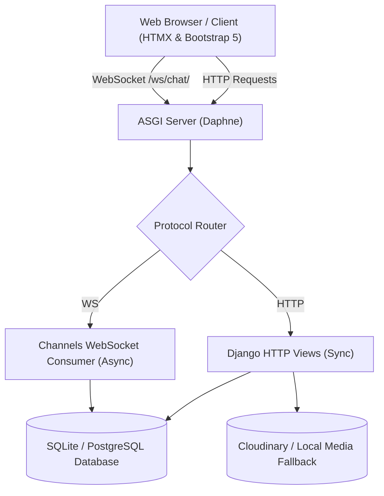

# 🎓 Team Finder — Interactive Portfolio & Academic Showcase

[](https://www.python.org/)
[](https://www.djangoproject.com/)
[](https://channels.readthedocs.io/)
[](https://htmx.org/)
[](https://getbootstrap.com/)
[](LICENSE)

> **Interactive Portfolio Showcase**: Explore the full team recruitment, applicant matching, real-time WebSocket chat, and peer review systems without requiring university student credentials or passwords.

---

## 🌟 Overview

**Team Finder** is a full-stack web platform designed to solve student teammate discovery across university faculties and majors. Originally engineered as an academic capstone project at Thammasat University, this repository has been enhanced into a **self-contained, interactive portfolio application**.

Recruiters, hiring managers, and developers can test all features end-to-end using pre-configured demo personas, automated data seeding, and multi-user simulation tools.

---

## ⚡ 1-Click Interactive Demo Personas

Visitors can switch personas anytime using the sticky demo switcher bar at the top of the app:

| Persona | Role | Primary Features to Test |
| :--- | :--- | :--- |
| 👑 **Alex Chen (`alex_lead`)** | **Team Leader** | Create recruitment posts, close/re-open recruitments, review & accept join requests, lead team chat rooms. |
| 🚀 **Sarah Jenkins (`sarah_app`)** | **Applicant / Designer** | Search recruitments by tag, verify eligibility, submit join requests, and participate in project discussions. |
| 🤖 **David Kumar (`david_ai`)** | **AI Teammate** | Demonstrates multi-member team collaboration, completed projects, and peer feedback radar ratings. |
| 🛠️ **Administrator (`admin`)** | **Superuser** | Access Django admin dashboard (`/admin`) for system moderation and tag administration. |

---

## 🚀 Key Features

### 1. 🔍 Smart Recruitment Board & Faculty Filtering
- **Targeted Requirements**: Post creators specify eligible faculties, majors, and academic year ranges (e.g. Year 1–4).
- **Dynamic Eligibility Verification**: The system evaluates applicant credentials in real-time and enables/disables the **"Request to Join"** action accordingly.
- **Instant Tag Search**: Tag-based filtering powered by `django-taggit`.

### 2. 👤 Clear Post Author Identity & Ownership Indicators
- **Author Transparency**: Post pages display the author's avatar, full name, faculty, major, academic year, and timestamp.
- **Ownership State Distinction**:
  - **Your Own Post**: Blue ownership banner with creator controls (**Close Recruitment**, **Re-open Recruitment**, and **Edit Post**).
  - **Other Student's Post**: Slate banner displaying viewing context, link to the author's profile, and dynamic application status (**Request to Join** or **Request Sent (Pending)**).
- **Role Badges in Comments**: Comment threads highlight the post `[Author]` vs. `[You]`.

### 3. 💬 Real-Time WebSocket Team Chat
- Powered by **Django Channels** and **Daphne ASGI** over persistent WebSockets.
- Instant message delivery with automatic reconnection, auto-scroll, and responsive layout.
- Access-controlled: Only accepted team members have access to a team's private chat group.

### 4. 📊 Completed Projects, Peer Reviews & Radar Stats
- **Finish & Showcase Flow**: Once a recruitment project finishes, leaders can publish results to the Project Showcase.
- **Peer Feedback**: Team members rate each other across 6 core teamwork metrics.
- **Interactive Radar Chart**: Visualized on `/mystats` using **Chart.js**.

---

## 🏗️ System Architecture



---

## 🛠️ Tech Stack

| Layer | Technologies |
| :--- | :--- |
| **Backend Framework** | Django 5.1, Python 3.11+ |
| **Real-Time / Async** | Django Channels 4, Daphne (ASGI) |
| **Frontend** | HTML5, CSS3, JavaScript (ES6+), Bootstrap 5.3, Boxicons |
| **Dynamic Interactivity** | HTMX, Tagify, Chart.js |
| **Database** | SQLite3 (Zero-setup local development, PostgreSQL ready) |
| **Media Storage** | Cloudinary with automatic graceful local filesystem fallback |
| **Testing** | Django TestCase unit test suite (70+ test cases) |

---

## 💻 Getting Started (Local Setup)

### Prerequisites
- **Python 3.10+** (Python 3.11 or 3.12 recommended)
- **Git**

### 1. Clone the Repository
```bash
git clone https://github.com/teerapatph/Team-Finder.git
cd Team-Finder
```

### 2. Create and Activate a Virtual Environment
```bash
# Windows (PowerShell)
python -m venv .env
.\.env\Scripts\Activate.ps1

# macOS / Linux
python3 -m venv .env
source .env/bin/activate
```

### 3. Install Dependencies
```bash
pip install -r requirements.txt
```

### 4. Run Migrations & Seed Demo Showcase Data
```bash
cd teamfinder

# Apply schema migrations
python manage.py migrate

# Seed rich demo personas, posts, teams, feedback, and chat groups
python manage.py seed_demo_data
```

### 5. Start the Development Server
```bash
python manage.py runserver
```
Visit **[http://127.0.0.1:8000](http://127.0.0.1:8000)** in your browser.

---

## 🎬 Recommended Demo Tour for Evaluators

Follow these 4 quick steps to experience the complete workflow:

```
1. Explore Recruitment Board
   └── Click "⚡ Explore Demo (1-Click)" on the homepage
   └── Filter projects by tags (#AI, #GreenTech, #MobileApp)

2. Test Applying as an Applicant
   └── Click "🚀 Sarah (Applicant)" on the top demo bar
   └── Open "Smart Campus Energy & Solar Monitor" (/post/4)
   └── Observe the "Posted by another student" banner
   └── Click "✉️ Request to Join" and submit your message
   └── Note the button immediately updates to "✓ Request Sent (Pending)"

3. Review & Accept Application as Leader
   └── Click "👑 Alex (Leader)" on the top demo bar
   └── Go to navbar: Team -> View Incoming Requests
   └── Click "Accept" on Sarah's request
   └── Sarah is instantly added to the team roster and private chat!

4. Live Team Chat & Peer Ratings
   └── Open the Team Chat room and send messages
   └── Navigate to "My Account" -> "My Stats" to view peer feedback radar charts
```

---

## 🧪 Running Automated Tests

Run the test suite with Django's built-in test runner:
```bash
python manage.py test teamfinder_app.tests
```

---

## 👥 Original Academic Team

- **Chaisiri Onlim** ([@6510615062](https://github.com/6510615062))
- **Teerapat Phosri** ([@6510615112](https://github.com/6510615112))
- **Tanapat Sa-nguantud** ([@6510615120](https://github.com/6510615120))
- **Suteethorn Kavinate** ([@6510615336](https://github.com/6510615336))

---

## 📄 License
This project is open-source under the [MIT License](LICENSE).
